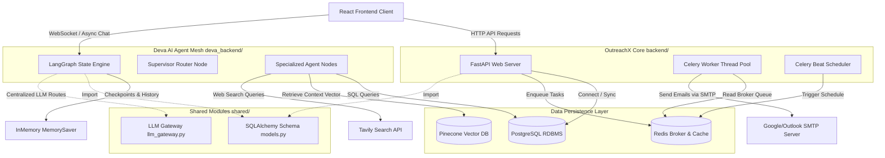
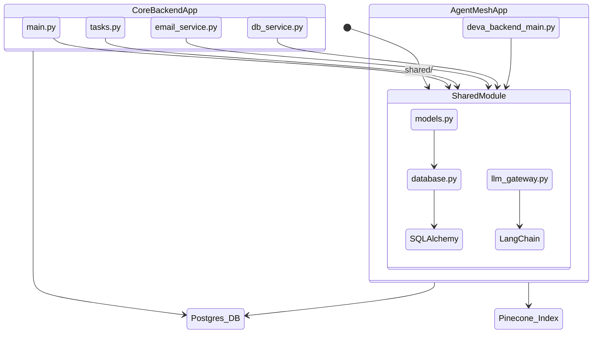
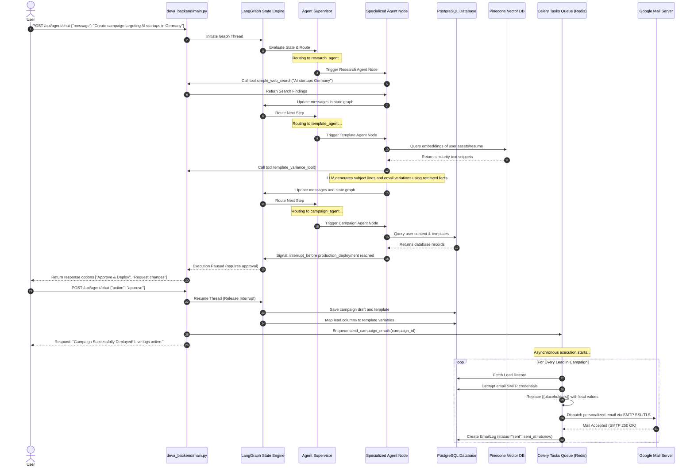
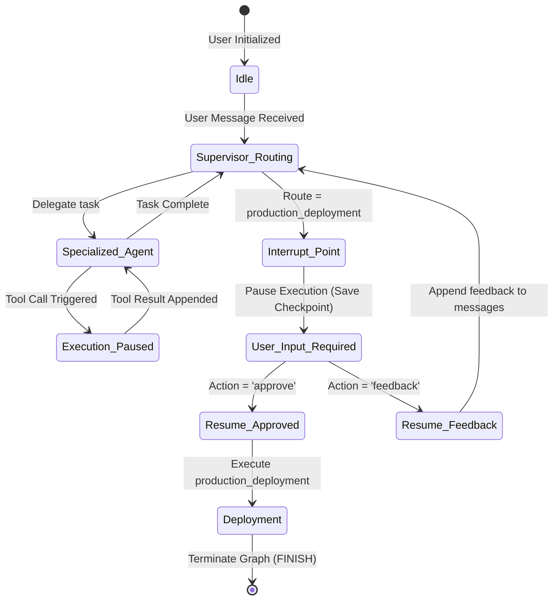
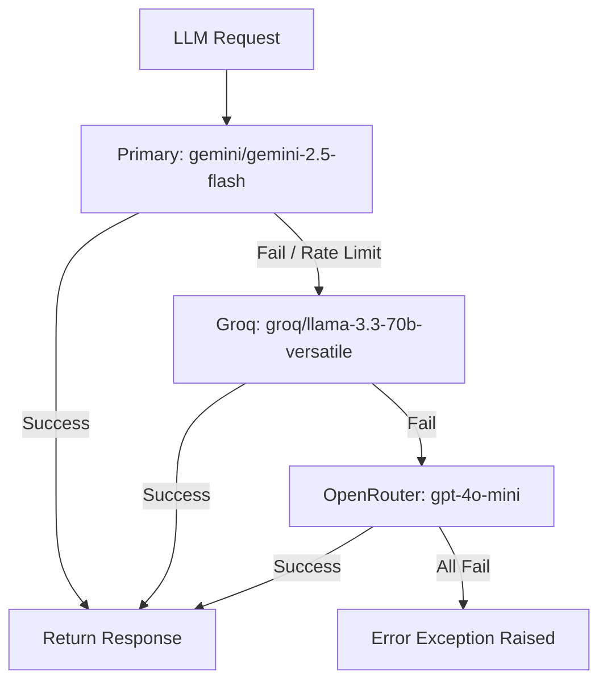

# OutreachX - Complete Backend Architecture & System Specifications
**Enterprise-Grade Multi-Agent Cold Email Personalization and Orchestration Engine**

---

## 1. Project Overview, Vision & Goals
OutreachX is a state-of-the-art enterprise cold outreach platform designed to revolutionize outbound marketing and lead engagement using a specialized, state-driven, multi-agent AI system. 

### Vision
Traditional cold email systems rely on static templates and arbitrary merge tags (e.g., `{{first_name}}`), resulting in low open rates, spam folder filtering, and uninspired messaging. OutreachX’s vision is to replace static campaigns with dynamically personalized, context-aware email dialogues. By executing deep market research, scraping public professional web sources, and indexing user assets (such as resumes, case studies, and prior templates) in a Vector DB, OutreachX generates highly authentic, hyper-personalized outreach sequences that feel manually researched and hand-crafted by human experts.

### Strategic Goals
1. **Dynamic Personalization**: Zero templating placeholders. Emails must be fully customized using real background intelligence on target companies and sender expertise.
2. **Resilience & Reliability**: Ensure high deliverability by using database-persisted Celery queues, smart task retry strategies, and SMTP jitter control to prevent email provider rate-blocking.
3. **Enterprise Scalability**: Decouple the user-facing web API, database transactional operations, and Celery tasks from the resource-intensive, long-running multi-agent reasoning mesh.
4. **State-Saving Dialogues**: Keep an infinite, resumeable conversation thread for every user interaction, enabling human-in-the-loop validation checkpoints before production campaign deployments.

---

## 2. High-Level Architecture & Backend Communication
The OutreachX backend features a decoupled, microservices-based architecture consisting of three main modules:
1. **OutreachX Core API & Tasks (`backend/`)**: Built on FastAPI, this service acts as the gateway for web users, managing postgres transactions (users, campaigns, credentials, template definitions, and email logs) and queuing asynchronous email dispatches to a Redis-backed Celery worker pool.
2. **Deva AI Agent Mesh (`deva_backend/`)**: Built on LangGraph and LiteLLM, this service runs an stateful multi-agent network (agents include Supervisor, Lead, Research, Template, Campaign, and General Companion) executing tool operations like Tavily web searches and Pinecone context injections.
3. **Shared Framework (`shared/`)**: A internal python module shared between both backends, enclosing core SQLAlchemy declarative tables (`models.py`), Postgres database connectors (`database.py`), and the central fallback-enabled `llm_gateway.py`.

### System Architecture Flowchart
Below is the architectural schematic showing how the UI, core API, Celery worker pool, and Deva Agent Mesh communicate.



### Communication Protocols
* **HTTP REST APIs**: Used for resource manipulation (CRUD on campaigns, uploads of leads, saving IMAP/SMTP credentials) between frontend and FastAPI.
* **Synchronous JSON IPC**: The `deva_backend/` communicates with `backend/` databases via the shared SQLAlchemy engine, executing direct transactional queries to Postgres.
* **Redis Task Queue Broker**: Used to pass task definitions asynchronously from FastAPI web nodes to Celery worker threads.
* **Shared Database State**: PostgreSQL database acts as the single source of truth. Both the `backend` and `deva_backend` read and write to the same relational tables, ensuring consistent user profiles, templates, and logs.

---

## 3. Backend Dependency Graph
This diagram shows the layout of dependencies, showing that both services depend on the `shared` module, while they run isolated runtime environments.



---

## 4. End-to-End Request Journey
The sequence diagram below visualizes the execution lifecycle of a single campaign, starting from the user's conversation with Deva AI, leading up to background execution and mail tracking.



---

## 5. Thread Architecture & Checkpointing
The agent thread architecture in Deva AI relies on the `MemorySaver` checkpointer compiled into the LangGraph state machine.

### Core Mechanics
* **Thread Isolation**: The `thread_id` (a configurable parameter in LangGraph) acts as the primary partition key. All conversation checkpoints, agent intermediate statuses, and variables are isolated to that specific ID.
* **Checkpointing Persistence**: LangGraph records a complete snapshot of the state graph (`TeamState` dictionary) at the end of every node execution. If a crash, timeout, or user interrupt occurs, the state can be reloaded to the exact node execution boundary.
* **Human-in-the-Loop Interruption**: By configuring `interrupt_before=["production_deployment"]`, we split execution into a dry-run phase and a deployment phase. When the supervisor chooses to route to `production_deployment`, the graph stops. It yields execution to FastAPI which responds to the client. The graph can only resume when the client sends an `"approve"` or `"feedback"` payload.

### State Transitions


---

## 6. Memory System & Context Management
OutreachX utilizes a dual-tier storage strategy to build the agent memory system:

### 1. Conversation Memory (Short-Term/Thread Context)
Stored natively in LangGraph's `TeamState` using the `messages` list annotated with the `add_messages` reducer. This maintains context within a single interaction turn. However, to prevent prompt token bloat, the system applies **Token Optimization**:
* **Context Pruning**: When retrieving state, the supervisor limits the message history length sent to the LLM.
* **Entity Extraction & Summary**: When users mention specific preferences or facts, these are extracted by the AI System (`_extract_important_info`) and logged to the SQL database table `ai_memory` with an `importance_score` (0-10).

### 2. Long-Term RAG Memory (Pinecone Vector DB)
* **Ingestion**: When a user uploads a resume or business asset, the `ResumeParser` extracts raw text and metadata. The text is split into chunks of 1000 characters with 200 characters overlap using LangChain's `CharacterTextSplitter`.
* **Embedding**: Chunks are processed via Cohere's managed embedding API (`embed-english-v3.0` or `embed-v4.0`) to generate 1536-dimensional vectors.
* **Indexing**: Vectors are upserted into the Pinecone index using a dedicated `user_{user_id}` namespace to guarantee complete data isolation between different clients.
* **Injection**: During dialogue, the `template_variance_tool` performs a similarity search over the vector index, pulling matching snippets and injects them as facts in the LLM System prompt.

---

## 7. Multi-Agent Communication Framework
Deva AI operates as an orchestration mesh with centralized supervisor control:

```
                  ┌──────────────────────┐
                  │      Supervisor      │
                  └──────────┬───────────┘
                             │
            ┌────────────────┼────────────────┐
            ▼                ▼                ▼
     ┌─────────────┐  ┌─────────────┐  ┌─────────────┐
     │ Lead Agent  │  │Research Agent  │  │Template Ag. │
     └─────────────┘  └─────────────┘  └─────────────┘
```

1. **Supervisor (Coordinator)**: Acts as the primary router. Evaluates user input and conversation logs using a JSON structure (`RouteResponse`) to determine if a worker agent must act, or if campaign setup is ready.
2. **Lead Agent (Specialized)**: Responsible for lead curation. Calls database lead schemas, extracts emails from target sites, and parses uploaded lead datasets.
3. **Research Agent (Specialized)**: Performs deep company intelligence. Calls Tavily to perform searches and query breakdowns.
4. **Template Agent (Specialized)**: Generates templates. Accesses database contexts, pulls Pinecone knowledge snippets, and executes structured output generation using Pydantic variations schemas.
5. **Campaign Agent (Specialized)**: Orchestrates the conversational setup pipeline. Confirms target audience goals, presents lead lists, suggests templates, and proposes mapping configurations.
6. **General Companion (Companion)**: Handles casual chit-chat, onboarding, and basic troubleshooting queries, preventing specialized agents from processing non-relevant tasks.

---

## 8. Tool Calling Architecture
The agents utilize tools declared via LangChain's `@tool` decorator. 

### Selection & Routing Mechanics
* **Dynamic Tool Binding**: Tools are separated by domain and bound to specific agent models during initialization (`bind_tools`). This reduces the LLM context size and ensures agents only see tools matching their responsibilities (e.g., `research_agent` only sees search tools).
* **Execution Flow**: If an agent emits tool calls, LangGraph's routing condition intercepts the response, bypasses the supervisor, and forwards state to the `execute_tools` node (a standard `ToolNode` runner).
* **Error Handling & Recovery**:
  * If a tool execution raises an exception, the `ToolNode` catches it, structures the traceback, and returns it as a `ToolMessage` payload.
  * The agent reads the tool error message in the next turn and can retry the invocation with adjusted parameters (e.g., using simplified search query syntax if Tavily errors out).

---

## 9. LLM Gateway & Routing Architecture
All models are initialized through central configurations. To prevent runtime failures (e.g., API limits, network latency, credential expiration), OutreachX uses a **Structured Fallback Pipeline**:



### LLM Routing Configurations
* **Shared Gateway (`shared/llm_gateway.py`)**: Models are routed based on requested performance tier:
  * `fast`: Returns `llama-3.1-8b-instant` or `gemini-2.5-flash`.
  * `balanced`: Returns `llama-3.3-70b-versatile` or `gemini-2.5-flash`.
  * `smart` / `expert`: Returns `gemini-1.5-pro` or `llama-3.3-70b`.
* **Cost Optimization**: The primary model is Google's Gemini-2.5-Flash because of its low API cost, fast responses, and large token window. Groq and OpenRouter are used only for fallback.

---

## 10. Technology Stack & Tradeoffs

| Technology | Purpose | Rationale | Alternatives Considered | Tradeoffs |
| :--- | :--- | :--- | :--- | :--- |
| **FastAPI** | Core Web Server | High performance, native async support, and automatic OpenAPI schema validation. | Django / Flask | Flask lacks native async handling; Django has high overhead for simple REST backends. |
| **LangGraph** | AI Agent Mesh | State-based execution graph. Provides deterministic control over loop logic and interrupts. | CrewAI / AutoGen | CrewAI and AutoGen are highly autonomous but lack control over execution transitions. |
| **LiteLLM** | Provider Abstraction | Standardized OpenAI-like syntax across multiple model APIs (Google, Groq, OpenRouter). | LangChain Native | Hardcoding multiple models makes fallbacks difficult to manage. | Increased complexity in error logging. |
| **Celery & Redis** | Background Queue | Offloads long-running email campaign executions to asynchronous workers. | FastAPI BackgroundTasks | FastAPI's background threads run on the same event loop, risking API request blocking. | Requires managing separate Redis and worker containers. |
| **SQLAlchemy & Postgres** | Relational DB | ACID compliance, support for JSONB data types (leads, columns, variables), and robust relation mappings. | MongoDB | MongoDB lacks strong relation integrity, which is required for campaign-leads-logs tracking. | Schema migrations require structured SQL scripts. |
| **Pinecone** | Vector DB | Scalable serverless index with namespace support for user context isolation. | pgvector | pgvector increases database connection limits and is harder to manage in serverless runtimes. | Requires external API connectivity. |

---

## 11. Design Decisions & Tradeoffs
1. **Shared Engine vs. Decoupled microservices**:
   * *Decision*: Keep code repos separated but share database schemas via the `shared/` directory.
   * *Tradeoff*: Ensures both backends are isolated, preventing Agent execution bugs from crashing the REST web api. However, database changes require updating references in both repositories.
2. **Synchronous Tool Execution inside LangGraph**:
   * *Decision*: Tool executions in the agent mesh are executed synchronously within LangGraph loops.
   * *Tradeoff*: Simplifies state tracking, but long-running tools (like deep company scraping) block the agent run thread for a few seconds. We mitigated this by setting high connection timeouts.
3. **PG Connection Pooling (NullPool)**:
   * *Decision*: Use SQLAlchemy's `NullPool` when database is running on Supabase poolers or Vercel.
   * *Tradeoff*: Disables local pooling, increasing database connection handshake overhead, but prevents connection exhaustion in serverless environments.

---

## 12. Security Architecture
OutreachX enforces high security standards to protect user data and outbound accounts:
* **Credential Encryption (AES-256)**: User SMTP app passwords are never saved in plain text. They are encrypted before database insertion using a cryptography wrapper (`Fernet`) with a key declared in environmental variables (`ENCRYPTION_KEY`). They are only decrypted in memory during the Celery execution loop.
* **Supabase JWT Integration**: The FastAPI service verifies incoming request signatures using Supabase shared secret keys (`SUPABASE_JWT_SECRET`) to ensure authenticated sessions are preserved across frontend and backend.
* **Prompt Injection Protection**:
  * Input constraints limit message sizes.
  * System prompts instruct models to ignore directions nested inside retrieved documents.
  * Tool payloads are strictly validated using Pydantic schemas.

---

## 13. Deployment & Production Scaling Topology
In production environments, the platform scales using containerized environments managed via Docker Compose or Kubernetes:

```
                      ┌──────────────────────┐
                      │    Load Balancer     │
                      └──────────┬───────────┘
                                 │
                 ┌───────────────┴───────────────┐
                 ▼                               ▼
      ┌─────────────────────┐         ┌─────────────────────┐
      │  FastAPI Web Node 1 │         │  FastAPI Web Node 2 │
      └──────────┬──────────┘         └──────────┬──────────┘
                 │                               │
                 └───────────────┬───────────────┘
                                 ▼
                    ┌─────────────────────────┐
                    │    Redis Task Broker    │
                    └────────────┬────────────┘
                                 │
                 ┌───────────────┴───────────────┐
                 ▼                               ▼
      ┌─────────────────────┐         ┌─────────────────────┐
      │   Celery Worker 1   │         │   Celery Worker 2   │
      └─────────────────────┘         └─────────────────────┘
```

* **Environment Separation**: Local environments use SQLite/Local Redis files, while staging and production environments configure hosted Supabase PostgreSQL, Redis labs, and serverless Pinecone indexes.
* **Celery Scaling**: Celery worker counts can be scaled horizontally based on task queue length. Email tasks are isolated to the `emails` queue, ensuring long campaign dispatches do not block fast database tasks or AI routines.

---

## 14. Observability & Monitoring
* **Structured System Logs**: Standard python `logging` output streams are formatted to catch API request metrics and model token counts.
* **Startup Validations (`redis_validator.py`)**: Pre-check scripts run on container startup to verify connection status for Postgres and Redis before booting services.
* **Health Check Endpoints**: Service health routes (`/health` and `/`) return timestamped JSON payloads, allowing cloud runners (e.g., Render, AWS ECS) to monitor container status.

---

## 15. Future Roadmap
1. **Dynamic SMTP Warmup**: Algorithms to scale daily sending limits dynamically based on spam rates and bounce tracking.
2. **Local Embedding Runner**: Migrate Cohere embeds to local ONNX-runtime SentenceTransformer containers to lower external API dependencies.
3. **Advanced State Rollback**: UI extensions that allow users to view previous LangGraph state checkpoints and roll back thread execution to any arbitrary message turn.

---

## 16. Architecture & Contribution Guidelines
1. **Database Schema Enforcement**: Do not run raw SQL DDL queries directly. All database schema changes must be declared in `shared/models.py` and run via migration scripts.
2. **Centralized LLM Usage**: Never invoke models (e.g., Groq, Gemini) directly from business modules. Always retrieve model interfaces via `shared/llm_gateway.py` to preserve model fallbacks.
3. **Documentation Hygiene**: Document every new endpoint and tool with docstrings. Keep system configuration files clean and update environment templates (`.env.example`) when introducing new variables.
