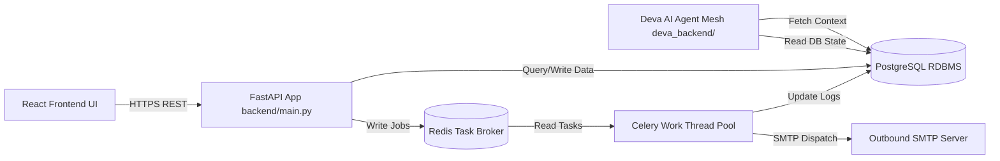
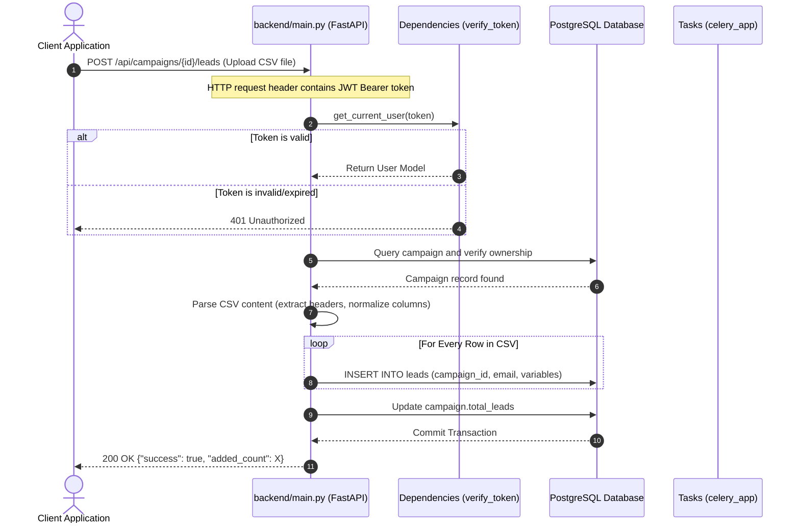

# OutreachX Core Backend Service (`backend/`)
**Transactional API Engine, Celery Worker Pools, and SMTP/IMAP Outbound Integration**

---

## 1. Overview
The Core Backend Service (`backend/`) serves as the foundation of the OutreachX SaaS platform. It handles the API layer, database operations, security validation, and outbound mail scheduling.

### Purpose & Problem Solved
Outbound email automation systems require high-reliability scheduling, bulk lead processing, secure credential storage, and status tracking. The Core Backend resolves these problems by providing:
* A structured REST API for CRUD operations on campaign resources.
* Secure storage for user passwords and SMTP credentials.
* An asynchronous queuing mechanism using Redis and Celery to handle long-running mail flows without blocking web operations.

### Responsibilities
* **User & Auth Management**: Implements JWT-based user authentication, signup validations, and OTP email dispatch.
* **Lead Operations**: Manages lead file CSV uploads, parsing schemas, and column layouts.
* **Email Orchestration**: Performs SMTP connections, encryption of app passwords, IMAP scan reviews for replies and bounce notifications.
* **Database Transact Services**: Central interface for reading/writing records (users, campaigns, logs, metrics).

### Architecture Philosophy
The service follows a **decoupled asynchronous model**. While FastAPI processes incoming web traffic, Celery worker nodes process background tasks (sending sequences, retries, periodic analytics updates). Both communicate via the Redis broker and PostgreSQL database state.

---

## 2. Position inside Deva AI
The core backend sits between the frontend React application, the relational storage layer, and the AI agent mesh.



### Upstream Dependencies
* **React Frontend**: Triggers HTTP REST API requests.
* **Supabase / Local Session JWTs**: Provides authentication bearer tokens.

### Downstream Dependencies
* **Deva AI Agent Backend**: Invokes agents for template variance and research when triggered.
* **PostgreSQL RDBMS**: Stores platform tables and relational data.
* **Redis Task Queue**: Acts as the message broker for Celery workloads.

---

## 3. Folder Structure
Below is a detailed inventory of folders and files inside the `backend/` directory:

```
backend/
├── Dockerfile                  # Containerization template for deployment
├── celery_config.py            # Broker queues, routes, and Beat intervals configuration
├── db_service.py               # Database CRUD abstraction methods
├── email_service.py            # SMTP and IMAP connection utility classes
├── imap_scanner.py             # Inbox check scanner for replies and bounce notifications
├── main.py                     # Entry point exposing API routes and endpoints
├── models.py                   # Imports and exposes database tables from shared library
├── redis_validator.py          # Database/Redis startup check script
├── resume_parser.py            # Text extraction and structured metadata parser for resumes
├── schemas.py                  # Pydantic model definitions for requests/responses validation
└── tasks.py                    # Celery task definitions (email dispatches, statistics)
```

### File Specific Details
* [main.py](file:///c:/Users/renuk/Projects/cold%20Mail%20Sender/backend/main.py): Sets up CORS middleware, initiates authentication dependencies (`get_current_user`, `verify_supabase_token`), and registers 50+ REST endpoints.
* [tasks.py](file:///c:/Users/renuk/Projects/cold%20Mail%20Sender/backend/tasks.py): Defines celery tasks like `send_campaign_emails` (iterates leads, substitutes placeholders, runs SMTP dispatches) and `update_all_campaigns_stats` (aggregates logs).
* [db_service.py](file:///c:/Users/renuk/Projects/cold%20Mail%20Sender/backend/db_service.py): Wraps database actions in static methods (e.g., `create_user`, `store_ai_memory`, `update_campaign_stats`) to maintain dry query separations.
* [email_service.py](file:///c:/Users/renuk/Projects/cold%20Mail%20Sender/backend/email_service.py): Implements SMTP mail dispatch using `aiosmtplib` and credentials validation via IMAP login checks.
* [imap_scanner.py](file:///c:/Users/renuk/Projects/cold%20Mail%20Sender/backend/imap_scanner.py): Connects to mail boxes, searches INBOX folders since a specific date, and flags matching inbound domains for campaign analytics.
* [resume_parser.py](file:///c:/Users/renuk/Projects/cold%20Mail%20Sender/backend/resume_parser.py): Uses PyPDF2/python-docx/PyTesseract fallback to extract raw resume text, and parses skills, education, and work experience using standard keyword patterns.
* [schemas.py](file:///c:/Users/renuk/Projects/cold%20Mail%20Sender/backend/schemas.py): Enforces type contracts and response envelopes (e.g., `APIResponse`, `CampaignCreate`, `SignupRequest`).

---

## 4. Complete Request Lifecycle
The lifecycle below demonstrates a lead file upload request:



---

## 5. API Documentation

### 1. Health Verification
* **URL**: `/health`
* **Method**: `GET`
* **Purpose**: Health check status.
* **Authentication**: None.
* **Success Response (200 OK)**:
  ```json
  {
    "status": "healthy",
    "timestamp": "2026-06-29T00:32:00Z"
  }
  ```

### 2. User OTP Authentication
* **URL**: `/api/auth/send-otp`
* **Method**: `POST`
* **Purpose**: Generates and sends a 6-digit OTP to the email.
* **Request Body**:
  ```json
  {
    "email": "user@example.com"
  }
  ```
* **Success Response (200 OK)**:
  ```json
  {
    "success": true,
    "message": "OTP sent successfully to your email."
  }
  ```
* **Error Response (400 Bad Request)**:
  ```json
  {
    "detail": "Email is already registered. Please sign in."
  }
  ```

### 3. Campaign Creation
* **URL**: `/api/campaigns`
* **Method**: `POST`
* **Headers**: `Authorization: Bearer <JWT>`
* **Purpose**: Declares a new campaign configuration.
* **Request Body**:
  ```json
  {
    "name": "Q3 Enterprise Sales Outreach"
  }
  ```
* **Success Response (200 OK)**:
  ```json
  {
    "id": "e0a6d10f-622e-46e2-9b24-747d95c1c8a1",
    "name": "Q3 Enterprise Sales Outreach",
    "status": "draft",
    "progress": 0
  }
  ```

### 4. Outbound Credential Submission
* **URL**: `/api/credentials`
* **Method**: `POST`
* **Headers**: `Authorization: Bearer <JWT>`
* **Purpose**: Encrypts and stores the user's SMTP/IMAP credentials.
* **Request Body**:
  ```json
  {
    "email_address": "sender@gmail.com",
    "app_password": "xxxx yyyy zzzz aaaa"
  }
  ```
* **Success Response (200 OK)**:
  ```json
  {
    "success": true,
    "message": "Credentials saved successfully."
  }
  ```

---

## 6. Security & Credential Protection
OutreachX uses a robust security layout to prevent unauthorized access:
* **AES-256 Encryption**: SMTP passwords are encrypted using a 128-bit key-derived Fernet cipher. The plain text values are only evaluated in memory during Celery mailing loops, shielding credentials from database leaks.
* **Passlib Bcrypt**: Local platform user password hashes are evaluated using password hashing algorithms (`bcrypt` context) with a built-in safety limit of 72 characters.
* **Token Verification**: Both FastAPI and Supabase session JWT tokens are verified using HS256 algorithm structures, preventing route exploitation.

---

## 7. Database Engine (PostgreSQL Schema)
The Postgres storage contains the following database models:

| Table Name | Primary Key | Description | Relationships |
| :--- | :--- | :--- | :--- |
| **`users`** | `id (UUID)` | Main user profile table. | Has many `campaigns`, `templates`, `assets`, `email_credentials`. |
| **`otp_codes`** | `id (UUID)` | Stores signup/verification tokens. | Belongs to `users`. |
| **`user_resumes`** | `id (UUID)` | Parsed user resume content. | One-to-One with `users`. |
| **`email_credentials`**| `id (UUID)` | Encrypted SMTP credential records. | Belongs to `users`. Has many `email_logs`. |
| **`templates`** | `id (UUID)` | Email template configurations. | Belongs to `users`. Linked to `campaigns` (M2M). |
| **`campaigns`** | `id (UUID)` | Campaign metrics, state, and layouts. | Belongs to `users`. Has many `leads`, `email_logs`, `campaign_tasks`. |
| **`leads`** | `id (UUID)` | Lists of prospects and details. | Belongs to `users` & `campaigns`. Has many `email_logs`. |
| **`email_logs`** | `id (UUID)` | Delivery logging status per email. | Belongs to `campaigns`, `leads`, `email_credentials`. |
| **`ai_memory`** | `id (UUID)` | User profile metadata for RAG. | Belongs to `users`. |
| **`campaign_tasks`** | `id (UUID)` | Tracks active Celery jobs statuses. | Belongs to `campaigns`. |

---

## 8. Asynchronous Task Architecture (Celery & Redis)
Asynchronous task flows run on isolated worker nodes to ensure responsive APIs.

### Queue Routing Configurations (`celery_config.py`)
Four direct exchanges routing keys segment workloads:
1. **`emails`** (Priority 10-9): Dispatches emails (`send_campaign_emails`) and triggers retries (`retry_failed_emails`).
2. **`default`** (Priority 8-5): Triggers stats updates (`update_campaign_stats`) and schedules campaigns (`schedule_campaign`).
3. **`cleanup`** (Priority 1): Periodically deletes old verification codes.
4. **`ai_tasks`** (Priority 5): Background retrieval tasks.

### Periodic Schedules (Celery Beat)
* **`process-scheduled-campaigns`**: Checks database every 60 seconds for campaigns scheduled to launch.
* **`update-campaign-stats`**: Refreshes metrics (open rate, bounce counts) every 5 minutes.
* **`cleanup-otp-codes`**: Cleans expired OTP logs every hour.
