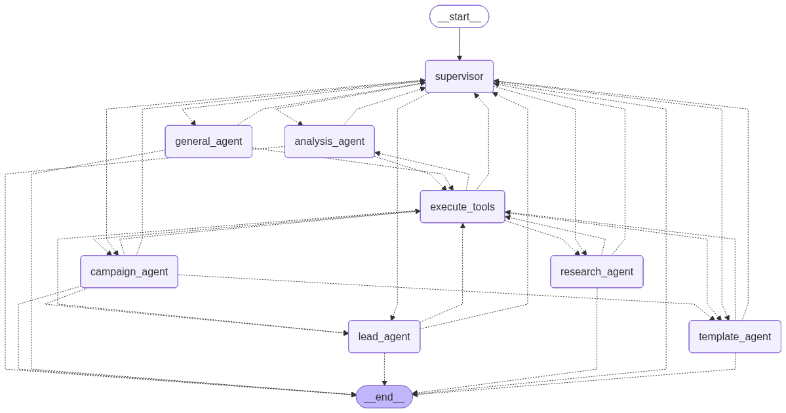
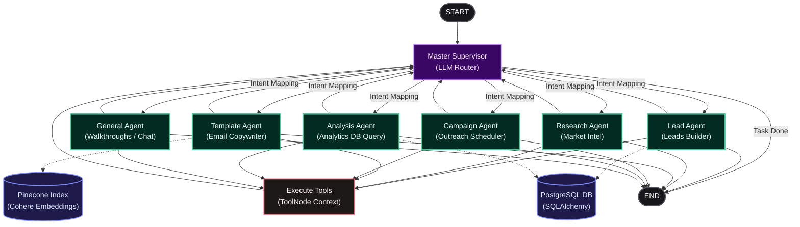

# OutreachX Deva: Production Multi-Agent Supervisor Mesh

An enterprise-grade, stateful multi-agent AI orchestration architecture implemented in [`notebook7.ipynb`](file:///c:/Users/renuk/Projects/cold%20Mail%20Sender/jupyter_notebook_deva_refrence/notebook7.ipynb). Built on **LangGraph**, **LiteLLM**, and **SQLAlchemy**, Deva acts as an autonomous outbound outreach mesh that structures campaigns, generates hyper-personalized templates, searches the live web, and executes database analytics.

---

## 🚀 Architecture Value Proposition

A single-LLM agent approach fails in production due to context drift, high token costs, and reasoning degradation. OutreachX Deva addresses this with a **Multi-Agent Supervisor Mesh**:

* **Specialized Division of Labor**: High-level reasoning is separated into discrete agent nodes. Each agent is restricted to context-specific tool boundaries to maximize task accuracy.
* **Stateful Memory Coordination**: A structured state schema (`TeamState`) propagates messages, database records, and citation documents across nodes.
* **Enterprise-Grade Resiliency**: A custom `FallbackLLM` gateway manages rate limits, API key failures, and fallback routing dynamically.

---

## 🗺️ System Topology & Data Flow

The runtime topology compiles into a stateful graph where a centralized **Master Supervisor** directs execution.

### Compiled Graph Visualisation

### Symmetrical Graph Routing Diagram

---

## 🛡️ Enterprise Resiliency & Security Gateways

### A. Fallback LLM Gateway (`FallbackLLM`)
To handle API downtime and token quota limits, the notebook uses a custom orchestration layer that manages multiple LLM providers sequentially:
1. **Primary Model**: `Groq/llama-3.3-70b-versatile` (Primary for fast reasoning and logic)
2. **First Fallback**: `Gemini/gemini-2.5-flash` (First fallback; handles large contexts)
3. **Second Fallback**: `OpenRouter/openai/gpt-4o-mini` (Final fallback; provides cost-efficiency)

### B. Cost Engine
Tracks exact token consumption (input/output) dynamically during execution and calculates run-time expenditures based on standard provider pricing tables.

### C. Active Guardrail Pipelines
* **Input Guardrail (Level 1)**: Sanitizes user inputs. Blocks common DDL/DML SQL injection syntax (`drop table`, `delete from`, etc.) and system instruction override attempts.
* **Output Guardrail (Level 3)**: Automatically intercepts and hides raw database connection URLs, masks private app passwords, and redacts database UUIDs to prevent sensitive data leaks.

---

## 🤖 Detailed Agent Node Specifications

* **Master Supervisor Node (`supervisor_node`)**:
  * Acts as the router. Extracts user intent from the state history to select the appropriate specialist agent.
* **Research Agent Node (`research_agent_node`)**:
  * Orchestrates web search actions. Uses a planner LLM to break complex user inquiries into three targeted sub-searches (`deep_research_pipeline`) to compile detailed intelligence reports.
* **Lead Gen Agent Node (`lead_agent_node`)**:
  * Automatically builds, validates, and cleans lead lists. Persists completed campaign lead structures directly to the database.
* **Template Copywriter Node (`template_agent_node`)**:
  * Extracts project and resume context from the Pinecone vector database using Cohere embeddings. Generates personalized cold email templates with brackets placeholders (`{{company_name}}`).
* **Campaign Scheduler Node (`campaign_agent_node`)**:
  * Maps lead columns to template variables, tests user SMTP configurations via verification codes, and triggers campaign launches.
* **Analytics Engine Node (`analysis_agent_node`)**:
  * Performs database queries to evaluate campaign performance, template success rates, and monthly trends.

---

## 🛠️ Symmetrical Tools Registry

The following table lists the database, vector search, and web tools dynamically bound to each agent:

| Agent Node | Bound Tools / Functions | System Purpose |
| :--- | :--- | :--- |
| **Lead Agent** | `web_search`, `scrape_website`, `get_user_context`, `extract_emails_from_url`, `generate_leads_batch`, `search_existing_lead_files` | Crawls corporate data, extracts emails, and formats lead lists. |
| **Research Agent** | `simple_web_search`, `deep_research_pipeline` | Solves simple lookups or runs deep multi-query market intelligence searches. |
| **Template Agent** | `get_user_context`, `retrieve_relevant_assets`, `generate_template_variations`, `save_template`, `list_user_templates` | Conducts vector semantic searches in Pinecone to compile tailored email body variations. |
| **Campaign Agent** | `fetch_user_context`, `search_existing_leads`, `search_existing_templates`, `propose_variable_mapping`, `verify_email_credentials`, `send_test_email`, `create_campaign`, `launch_campaign` | Tests SMTP transport channels, maps variables, and schedules email campaigns. |
| **Analysis Agent** | `list_user_campaigns`, `get_campaign_performance`, `compare_templates_performance`, `list_lead_files`, `get_user_assets_summary`, `analyze_campaign_trends`, `get_best_performing_template`, `get_recent_email_activity`, `get_top_lead_sources`, `get_user_overall_stats`, `get_monthly_performance`, `get_bounce_reasons`, `get_email_credential_status`, `list_all_user_templates`, `get_low_performing_campaigns`, `search_conversation_memory` | Runs performance metrics queries and analyzes campaign trends. |

---

## 🔄 State Machine Lifecycle (`TeamState`)

1. **Intake**: User request updates the graph state.
2. **Routing**: Supervisor selects the specialist agent.
3. **Execution**: Selected agent calls its tools (SQL Database, Vector DB, Web Scraper).
4. **Guardrail Check**: Output guardrails sanitize responses.
5. **Loop/Finish**: Supervisor evaluates the results and either routes to another agent or ends the session (`FINISH`).
